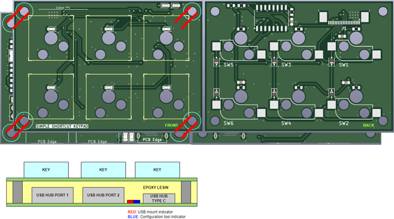

# Simple Shortcut Keypad.
 This has six keys that are customizable, and this designed for disabled peoples. I'm working with disabled brother. he's a survivor of car-crash in highway, I don't know details. A few days ago, I asked him how to press `Ctrl + Alt + Del` key combinations, he answered that "I've gave up to press these kind of key combinations, forever". I thought that, if there is a special keyboard to help him, he will never need to give up to press complex key combinations. this project is for that.
 of course, this is also for gamers and quick `NSFW`, haha!

## Boards
This project is consisted of two boards. one is a USB hub port and `RP2040` board and other one is keypad board. this two boards are connected through `FPC` cable. and fixed by steel bolt bars.

### Lower board

### Upper board

### Assembly diagram

## Firmware
Work in progress

## Configuration Tool
Work in progress